## 💻 Task Juggler and Thumbnails Slider

A lightweight Windows utility for power users who juggle many folders, files, and windows at once. It combines a customizable quick-access **launcher** with a **thumbnails slider** for fast visual browsing, plus built-in virtual desktop switching.

## ⭐ What it does

- **Launcher** — A compact, themeable panel for jumping between your favorite folders, switching active windows/tabs, and managing exceptions, all from one hotkey-triggered popup.
- **Thumbnails Slider** — Resize and preview thumbnails on the fly, in multiple slider sizes, so you can scan through images or files without opening each one.
- **Selection Tools** — Select files by pattern, select all items of the same extension, and keep a history of your selections so you can restore or backtrack to a previous selection instantly.
- **Virtual Desktop Integration** — Add, remove, and cycle through virtual desktops directly from the launcher, with visual indicators for the active desktop.
- **Fully Themeable** — Pick colors for the header, background, progress indicators, and more, with a built-in color picker and several ready-made themes.

## 📌 How to Use

1. Download and extract **`AIO_Task_Juggler_and_Thumbnails_Slider_26_08_12_V1.1.7.6.zip`** — this all-in-one package contains everything needed, already extracted and ready to run.
2. Launch only the **main executable** (`Task_Juggler_and_Thumbnails_Slider_26_08_12_V1.1.7.6_X64.exe`).
3. Do **not** run `VD_DATA.exe` directly — it's a background helper module used internally for virtual desktop detection and is launched automatically by the main app when needed.

## 🌞 Launcher Themes

<table>
<tr>
<td align="center"><b>Midnight Blue</b> 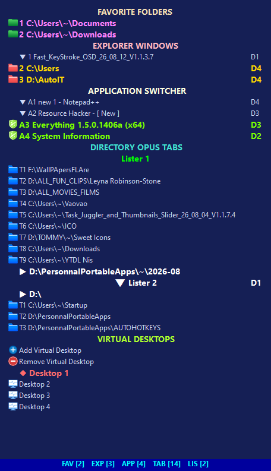</td>
<td align="center"><b>Dark Red</b> 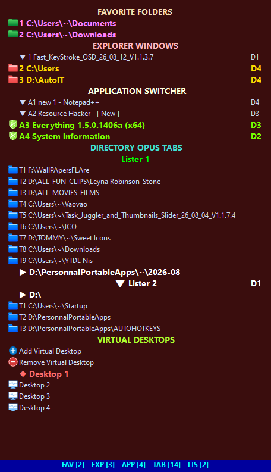</td>
</tr>
<tr>
<td align="center"><b>Dark Green</b> 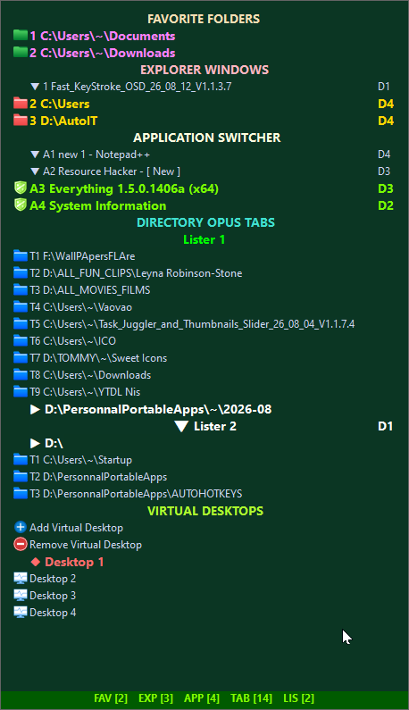</td>
<td align="center"><b>Midnight Purple</b> 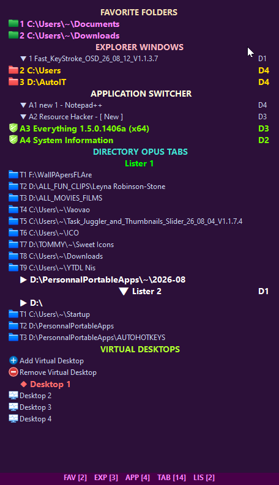</td>
</tr>
</table>

Four ready-made color themes for the launcher, switchable at any time from the settings panel.

**♦️Visual overview:**

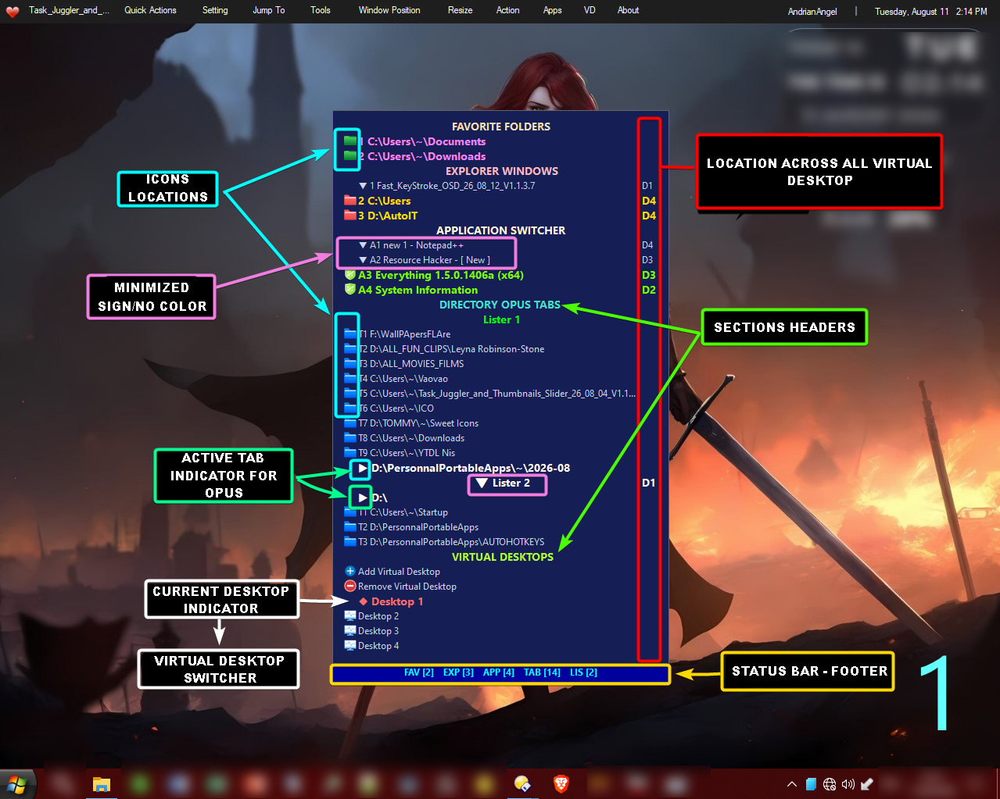

*Breakdown of the launcher's main visual elements and layout.*

## 🔧Settings

<table>
<tr>
<td align="center"><b>Favorite Folders</b> 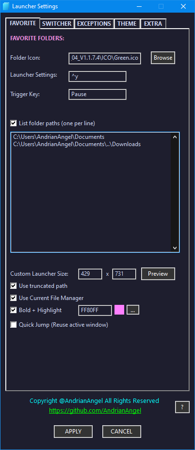 Manage the folders that appear in your launcher for quick access.</td>
<td align="center"><b>Switcher</b> 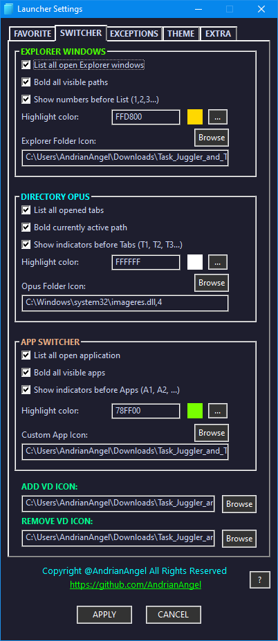 Configure how window/tab switching behaves.</td>
<td align="center"><b>Exceptions</b> 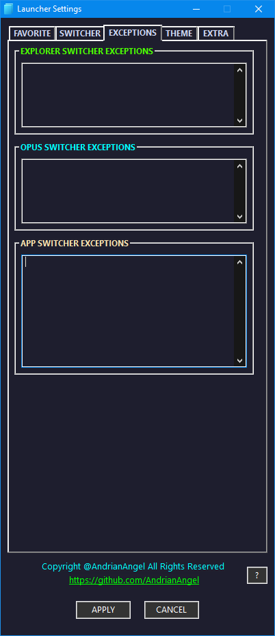 Exclude specific folders or apps from launcher actions.</td>
</tr>
<tr>
<td align="center"><b>Theme</b> 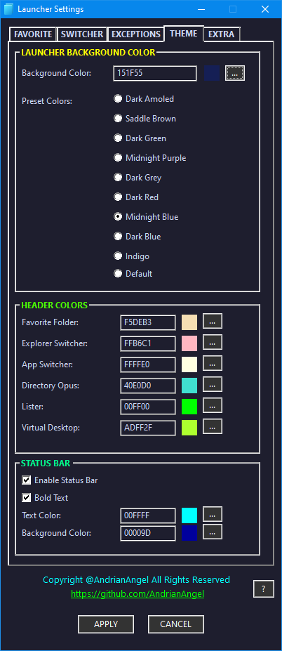 Customize colors and appearance of the launcher.</td>
<td align="center"><b>Extra</b> 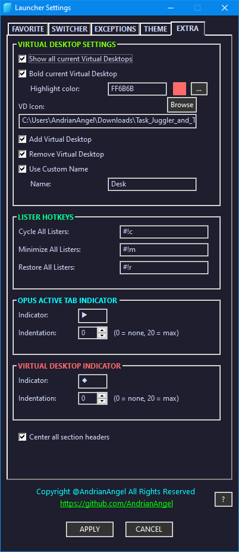 Additional options and fine-tuning settings.</td>
<td align="center"><b>Color Picker</b> 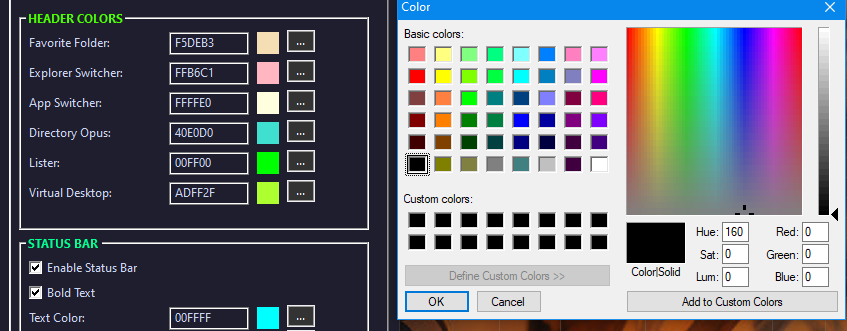 Built-in color picker for custom theme colors.</td>
</tr>
</table>

## 🔵 Thumbnails Slider

<table>
<tr>
<td align="center"><b>Slider Settings</b> 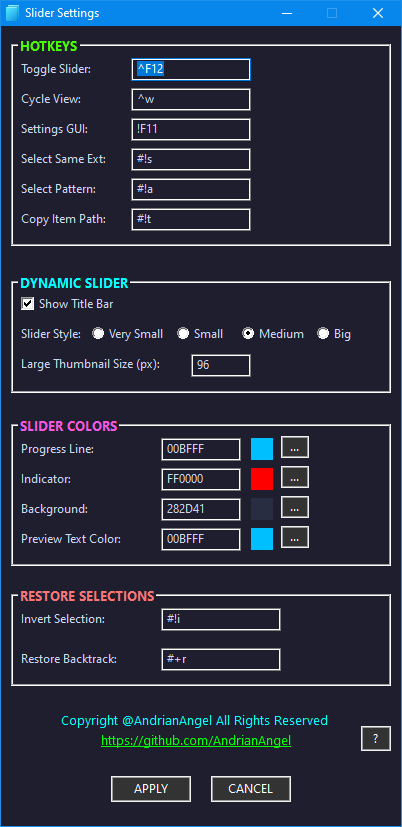 Configure slider behavior and appearance.</td>
<td align="center"><b>Slider Sizes</b> 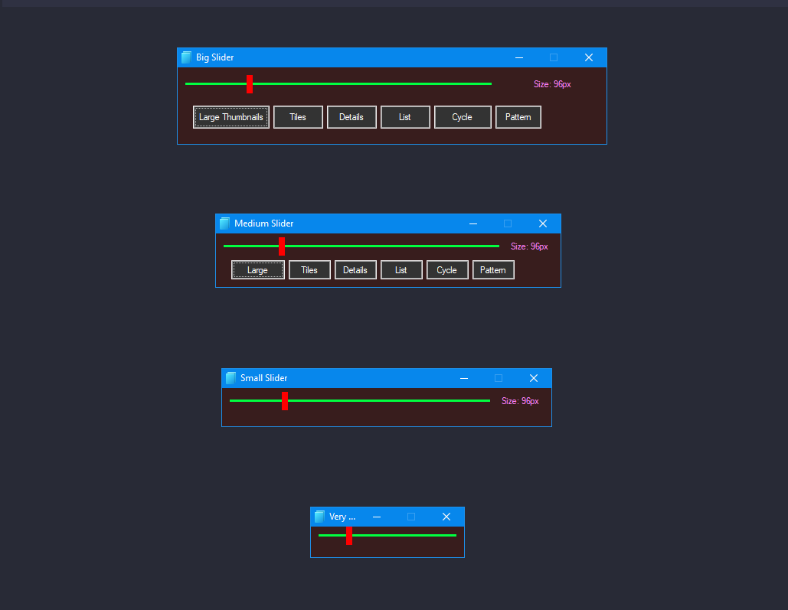 Choose between multiple slider sizes to fit your workflow.</td>
</tr>
<tr>
<td align="center"><b>Pattern Selection</b> 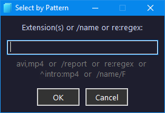 Select files by pattern using a dedicated input dialog.</td>
<td align="center"><b>Selection History</b> 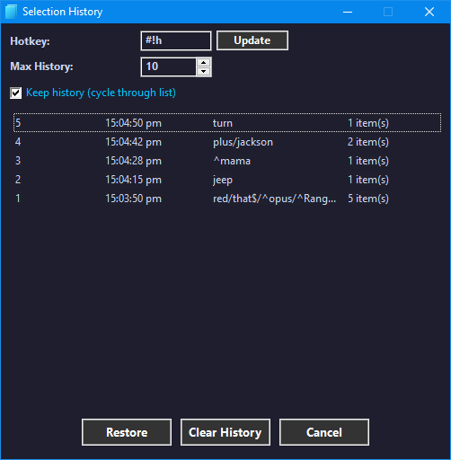 Browse and restore previous selections.</td>
</tr>
</table>

## 🎥 Demos

| | |
|---|---|
| **Resize Preview** 

 Live preview while resizing the thumbnails slider. | **Lister (Opus) Tab Switch + Virtual Desktop** 

 Switching between Opus lister tabs alongside virtual desktops. |
| **Minimize / Restore / Cycle Listers** 

 Minimize, restore, and cycle through all open Opus listers. | **App Switch + Explorer Switch** 

 Quickly switch between running apps and Explorer windows. |
| **Slider in Action** 

 The thumbnails slider being used to browse files visually. | **Pattern Select + Backtrack + History** 

 Selecting by pattern, restoring a backtrack, and using the history GUI. |

**Help Reference:**

*How to access the built-in help panel.*

## 🔥 Downloads

- `Task_Juggler_and_Thumbnails_Slider_26_08_12_V1.1.7.6_X64.exe` — standalone executable
- `Task_Juggler_and_Thumbnails_Slider_26_08_12_V1.1.7.6_X64.zip` — portable version
- `AIO_Task_Juggler_and_Thumbnails_Slider_26_08_12_V1.1.7.6.zip` — all-in-one package (extract and run, includes everything)
- `ICO.zip` — icon pack
- `VD_DATA.exe` / `VD_DATA.zip` — internal virtual desktop helper (not meant to be run manually)

---
Copyright © AndrianAngel ❤️ — All rights reserved.
